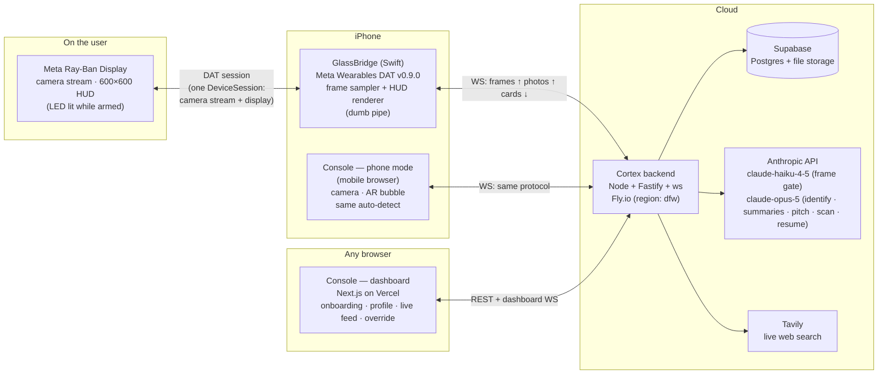

# Wingman — Technical Design Document (v2)

**Project codename:** Wingman (zero-touch career-fair copilot for Meta Ray-Ban Display)
**Event:** HackRice 16, Rice University · 36-hour build
**Team:** 3 people (P1, P2, P3 — see §6)
**Status:** Frozen for implementation (v2, post-grill design review 2026-09-12). Supersedes v1 entirely: **no microphone, no voice, no Neural Band input — vision-only, fully automatic.** Do not re-litigate mid-hackathon.
**Implementation split:** two machines build this in parallel — see **DESIGN_WINDOWS.md** (repo root + all TypeScript) and **DESIGN_MAC.md** (`glassbridge/` only). Path ownership and the merge contract live in those files; this document remains the single normative copy of every cross-machine contract (§4, Appendices C/D).

---

## 0. What this is

Wingman is a zero-touch heads-up copilot for student career fairs. The user wears Meta Ray-Ban Display glasses with a Start-armed session. **They never say anything, press anything, or gesture anything.**

- **Look at a booth** → Wingman detects the banner in the continuous camera stream, identifies the company against a pre-indexed employer corpus (live web search fallback), and a summary card appears in the right lens within ~5 seconds of the banner being stably in view.
- **Keep wearing it** → the card auto-rotates to a personalized elevator-pitch page generated from the user's uploaded resume and profile links.
- **Hold up a pamphlet** → Wingman detects the document, captures a high-res photo, extracts roles/deadlines, and merges them into the card. Automatically.

A phone mode mirrors the whole experience in a mobile browser (phone camera + AR-style bubble overlay, same auto-detection) so the demo survives any hardware failure.

### Locked decisions (v2 design review)

| # | Decision |
|---|----------|
| D1 | Hardware: Meta Ray-Ban Display. Native iOS path: one Swift app (GlassBridge) owns glasses **camera stream and display** via Meta Wearables DAT **v0.9.0** (SPM: `facebook/meta-wearables-dat-ios`, iOS 17.2+, Meta AI app v272+, glasses firmware v125+). **No microphone use. No Neural Band input** — the Band ships with the hardware and may be needed to accept the display session on-glasses, but Wingman consumes zero Band events. Web-app-on-glasses path is NOT used. |
| D2 | Glasses are a pluggable I/O layer. Phone mode is a separate, toggleable device adapter with identical backend behavior — same frames up, same cards down. |
| D3 | **Zero-touch trigger model:** while armed, the device streams sampled camera frames continuously; Cortex's `SceneGate` (claude-haiku-4-5 vision) classifies each frame `banner \| document \| nothing`. Detection is fully automatic — there is no user-initiated trigger of any kind on any device. Dashboard override is the only manual path and it is operator-side (demo safety), not wearer-side. |
| D4 | Pipeline events frozen at **three**: `company_detect` (auto, from gate), `scan_detect` (auto, from gate), `override` (dashboard). No intents, no STT, no NLU anywhere in the system. |
| D5 | Company-level identification only (banner/signage). **No facial recognition, no person-level ID.** Face *detection* is used only client-side in phone mode to anchor the bubble; nothing is identified or stored. No face processing server-side, ever. |
| D6 | Corpus: pre-scraped HackRice 16 sponsors (~20+, list pending publication) + ~30 marquee employers, live web search fallback (Tavily). Both behind one `ContextProvider` interface. LinkedIn is cut as a source. |
| D7 | Latency contract: **banner stably in view → summary first content < 5 s** · **pitch page ready < 10 s** · **document stably in view → merged card < 8 s**. Two contract terms (not optimizations): summary cards for corpus companies are **pre-generated at ingest**, and all frames/photos are **downscaled client-side** before upload (Appendix D). |
| D8 | Single-user demo. Managed auth (Clerk), one seeded account. Resume PDF + LinkedIn/X/GitHub/personal-site URLs collected in web-app onboarding. |
| D9 | Device linking: GlassBridge uses a TV-style 6-digit code shown on the dashboard. Phone mode uses `POST /api/devices/self-claim` (Clerk-authenticated, mints its own token — no code dance in a mobile browser). Past links cached and listed on home screen. |
| D10 | Session survives closing the dashboard. Requires phone on with GlassBridge running; background streaming is supported by DAT (since v0.5.0). GlassBridge runs a **silent-audio keepalive** (§5.1) so iOS keeps the process alive when the phone locks; whether the DAT stream itself keeps delivering under lock is undocumented — verified at M2, with Auto-Lock Never / Guided Access as the zero-code fallback. Phone-off is out of scope. |
| D11 | Output: display only. No TTS. Company cards are a **two-page auto-rotation**: summary page first (≥ 5 s), then alternate with the pitch page every 12 s, footer marker "1/2 · 2/2". A card set persists until a *different* company is stably identified (and the current set has been visible ≥ 5 s) or Stop. A card is never cleared by looking away: an identification that started always runs to completion. |
| D12 | Every module seam carries an `// INTEGRATION:` comment block (§5). Three people build three isolated components against frozen contracts. `shared/protocol.ts` freezes at hour 2. |
| D13 | **Churn rules** (the product's core tuning, §3.3): stability = same gate class on 2 consecutive frames before acting · single-flight = one identify/scan in flight, frames dropped while busy · cooldown = a presented company is suppressed from re-identification for 1 min (override bypasses) · replace-on-change = a different stable company replaces the card set · **below 0.25 confidence, or no corpus hit, the name is researched, not silenced** — the live path (Tavily → condense) runs behind a "Researching…" card; only a banner with *no* name at all renders nothing. The doubt is still logged to the dashboard feed so the operator can override. · **no-match backoff** = after no_match / search_down / identify_timeout the same gate `orgHint` is not re-identified for 20 s, so an unreadable banner cannot loop ack → hint → ack. |
| D14 | **Always-on capture optics, accepted deliberately:** the capture LED is lit continuously while armed (forced by platform — this is the honest signal). Frames are ephemeral: gated in memory, never persisted; document photos discarded after extraction; no audio exists at all. Battery cost of continuous streaming is **accepted** (arm per demo run, charger in pocket, measured at M2). Say all of this to judges proactively — it's a strength. |

---

## 1. System architecture

Four deployable components. The glasses never talk to our backend directly — everything rides through the phone.



**Cortex** is the only smart component. GlassBridge and the phone-mode page are interchangeable "device adapters": they push sampled frames up and render `HudCard` payloads down. Zero product logic on devices — even card rotation is timed by Cortex (devices just render the latest `render` message). That symmetry is what makes the glasses layer swappable (D2) and the demo failure-proof.

**There is no STT, no audio path, and no user-input path anywhere in this diagram.** That is the design, not an omission.

---

## 2. Tech stack

| Concern | Choice | Why (hackathon lens) |
|---|---|---|
| Web app | **Next.js 15 + TypeScript + Tailwind**, on Vercel | Team knows web; one framework for onboarding, dashboard, phone mode |
| Auth | **Clerk** | Drop-in `<SignIn/>`; one seeded demo account (D8); ~1 hour total |
| Backend | **Node 22 + Fastify + `ws`**, on Fly.io **region `dfw`** (Railway backup) | Long-lived WebSockets; Dallas region = free latency to Houston; same language as frontend; shared types package |
| DB + files | **Supabase** (Postgres + Storage) | One managed service for corpus, profiles, device links, resume PDF. **No vector DB** — corpus ≤ 60 companies; identification returns a *name*; lookup is exact/alias match. If it ever grows to thousands, add pgvector — `ContextProvider` doesn't change |
| Glasses SDK | **Meta Wearables DAT v0.9.0** (Swift, SPM `facebook/meta-wearables-dat-ios`, iOS 17.2+) | Camera streaming (HEVC, background-capable since v0.5.0) + display rendering (declarative components, since v0.7.0). Requires Developer Mode in Meta AI app, tester enrollment (≤ 100 testers), Meta AI app v272+, firmware v125+ |
| iOS distribution | Xcode free "Personal Team" sideload | Installs expire in 7 days (fine); re-sign morning of demo day |
| LLM — frame gate | **`claude-opus-5`** vision, `effort: "low"` (`GATE_MODEL` env overrides; `claude-haiku-4-5` is the cheap fallback) | Classifies every sampled frame (`banner\|document\|nothing`); ~2 s p50. Haiku missed small/on-screen logos in real glasses frames |
| LLM — reasoning/vision | **`claude-opus-5`** — adaptive thinking, streaming, `output_config.effort: "low"` for identify | Banner ID, Tavily-path summaries, pitch, pamphlet extraction, resume parse — one provider |
| Resume parsing | Claude PDF input (base64 `document` block, no beta) | No OCR library — PDF straight to opus-5, profile JSON via structured output |
| Live search | **Tavily** | One-call answers; behind `ContextProvider` (D6) |
| Phone-mode vision | **MediaPipe Tasks (JS)** face *detection* | Client-side bubble anchoring only (D5); those frames never leave the phone |
| Monorepo | pnpm workspaces: `console/ cortex/ glassbridge/ corpus/ shared/` | `shared/` holds protocol + schemas + constants; Swift mirrors by hand |

**Model calls — house rules (all routes):**
- Exact IDs `claude-opus-5` / `claude-haiku-4-5` — never append date suffixes.
- **opus-5:** adaptive thinking is the default — omit `thinking` or send `{"type":"adaptive"}`; `budget_tokens` returns a 400. `output_config.effort: "low"` for identify and the gate-adjacent fast paths, default for pitch/resume.
- **Gate model:** `claude-opus-5` at `effort: "low"`, `max_tokens` 512 (adaptive thinking draws from it). `GATE_MODEL=claude-haiku-4-5` restores the cheap gate — haiku does **not** support adaptive thinking, so **omit `thinking` entirely** there (`max_tokens` 128).
- Structured outputs via `output_config.format` (the old `output_format` param is deprecated; assistant prefill no longer exists). Schemas in Appendix C, exported from `shared/schemas.ts`.
- Enable server-side refusal fallbacks on every opus-5 call: `betas: ["server-side-fallback-2026-07-01"], fallbacks: "default"`. Check `stop_reason === "refusal"` on every response regardless.
- Streaming for anything long (pitch, Tavily summaries, resume parse).
- **Prompt caching is load-bearing for the gate** (it runs ~34×/min): keep system prompts byte-stable, put the frame image last in the user turn, `cache_control` breakpoint after the system prompt. Same discipline on identify — the corpus name/alias list lives in the *system* prompt (stable → cached), the image comes last.

---

## 3. Data flow & sequence

### 3.1 Happy path (glasses)

```mermaid
sequenceDiagram
    participant U as User (does nothing)
    participant G as Glasses
    participant B as GlassBridge
    participant C as Cortex
    participant A as Anthropic

    Note over B,C: Session ARMED — camera streams; B samples 1 frame / ~1.75 s
    B->>C: frame (768px JPEG)
    C->>A: haiku gate: classify frame
    A-->>C: { class: "nothing" }
    U->>G: (walks up to a booth, looks at banner)
    B->>C: frame
    C->>A: haiku gate
    A-->>C: { class: "banner", orgHint: "Stripe" }
    B->>C: frame (next sample)
    C->>A: haiku gate
    A-->>C: { class: "banner", orgHint: "Stripe" }  — 2nd consecutive: STABLE
    C->>B: render ack card ("Identifying…")
    C->>A: opus-5 vision identify (frame + corpus alias list, effort low)
    A-->>C: { corpusId: "stripe", confidence: 0.93 }
    C->>C: ContextProvider: corpus hit → PRE-GENERATED summary card
    C->>B: render company card (page 1/2)   [< 5 s from stable view]
    C->>A: opus-5: pitch (profile + company record, streaming) — auto-started
    C->>B: render pitch page (2/2)          [< 10 s]
    Note over C: rotation timer alternates pages every 12 s (summary holds ≥ 5 s first)
    U->>G: (holds up a pamphlet)
    C->>C: gate: "document" × 2 → STABLE
    C->>B: capture_photo (quality: document)
    B->>C: photo (2048px JPEG)
    C->>A: opus-5 vision: extract roles/dates/contacts
    C->>B: render updated company card (merged)  [< 8 s]
```

### 3.2 Pipeline stages and budgets

| Stage | Work | Budget |
|---|---|---|
| F0 | Sampled frame arrives (cadence ~1.75 s, ≤ 768 px, ≤ ~120 KB) | — |
| F1 | gate classify — `claude-opus-5` effort low (cached system prompt) | ~2 s (haiku ~1.3 s) |
| F2 | Stability check: 2nd consecutive matching class | worst case +1 cadence interval |
| F3 | Ack card rendered ("Identifying…") — only after stability, so no churn from glances | — |
| F4 | `claude-opus-5` vision identify (effort `low`, structured output) | ~1–2 s |
| F5 | Corpus hit → **pre-generated card renders instantly** · miss → Tavily (+1–2 s) + streamed summary | **< 5 s from stable view** ✅ D7 |
| F6 | Pitch auto-generation (kicked off at F5 success; profile pre-loaded at session start) | **< 10 s** ✅ D7 |
| F7 | Document path: stability → `capture_photo` (~1–2 s) → opus-5 extraction (~2–3 s) → merged card | **< 8 s** ✅ D7 |

The gate is what makes always-on vision affordable: haiku sees every frame (~$0.07/min); opus-5 fires only on stable detections. The pre-generated corpus cards are what make < 5 s honest: opus-5's identify latency is slack, not load-bearing.

### 3.3 Session state machine (Cortex `SessionOrchestrator`)

```
IDLE ──start──▶ ARMED (streaming + gating every frame)
ARMED:   banner ×2 stable, not in cooldown, no flight ──▶ IDENTIFYING
         document ×2 stable, no flight ──────────────────▶ SCANNING
IDENTIFYING: corpus hit, confidence ≥ 0.25 ──▶ PRESENTING (render card set, start pitch, start rotation)
             unsure (no corpus hit OR confidence < 0.25) + a usable name (nameGuess, else gate orgHint)
                 ──▶ RESEARCHING ("Researching…" card; ContextService live path: exact row → Tavily → condense)
                     found ──▶ PRESENTING (identical to a corpus hit)   not found / search down ──▶ hint → ARMED
             unsure with no name at all ──▶ hint → ARMED
             timeout / no_match / search_down ──▶ degraded hint card ONCE → ARMED + 20 s identify backoff for that orgHint
             (a backed-off orgHint is dropped silently: no ack, no hint, no LLM call. A different orgHint bypasses it.)
PRESENTING:  gating continues; `nothing` frames change nothing — an identify/pitch in flight always completes.
             different company ×2 stable & current set shown ≥ 5 s ──▶ IDENTIFYING (replace)
             same company ──▶ suppressed (1-min cooldown)
             document ×2 stable ──▶ SCANNING → merge into current card set
SCANNING (no company context): standalone kind:"scan" card → PRESENTING
any state ──stop──▶ IDLE (session memory purged: frames, photos, context)
Dashboard override: force companyId at any time → PRESENTING (bypasses gate, cooldown, confidence)
```

**D13 rules are enforced here:** single-flight (frames dropped while an identify/scan is in flight), stability (×2), cooldown map (companyId → timestamp), research-instead-of-silence below 0.25, no-match backoff map (orgHint → timestamp). Rotation is a Cortex timer: page 1 ≥ 5 s, then alternate every 12 s; every rotation is just another `render` with the same `cardId`, higher `seq`.

---

## 4. API contracts

All types live in `shared/protocol.ts` — **frozen at hour 2, changed only by all-hands agreement.** Swift mirrors them in `Protocol.swift`. The protocol is now **100% JSON text frames** (no binary — audio is gone).

### 4.1 REST (Console ↔ Cortex; Clerk JWT in `Authorization: Bearer`)

```
POST /api/profile/resume          multipart PDF        → { "profile": ProfileSummary }
PUT  /api/profile/links           { "linkedin"?, "x"?, "github"?, "website"? } → 200
GET  /api/profile                                      → { "profile": ProfileSummary, "links": {...} }
POST /api/devices/link-code                            → { "code": "483291", "expiresAt": ISO }   // dashboard shows code
POST /api/devices/claim           { "code", "deviceType": "glasses_bridge", "name" }
                                                       → { "deviceId", "deviceToken" }             // GlassBridge calls this
POST /api/devices/self-claim      { "name": "James's phone" }
                                                       → { "deviceId", "deviceToken" }             // phone mode; idempotent per user
GET  /api/devices                                      → [ { "deviceId", "deviceType", "name", "lastSeen" } ]
POST /api/session/start           { "deviceId" }       → { "sessionId" }                           // dashboard-initiated
POST /api/session/stop            { "sessionId" }      → 200
POST /api/session/override        { "companyId" }      → 200   // demo safety: force identification
GET  /api/companies?q=stri                             → [ { "companyId", "name" } ]   // powers override picker
```

`ProfileSummary` (produced once by resume parse at upload time, cached):

```json
{
  "name": "James Li",
  "headline": "CS @ UT Austin, class of 2027",
  "skills": ["TypeScript", "Python", "embedded systems"],
  "experiences": [
    { "org": "Guadaloop", "role": "Software lead", "highlight": "Built telemetry pipeline for hyperloop pod" }
  ],
  "interests": ["fintech infrastructure", "AR/wearables"],
  "links": { "github": "https://github.com/…" }
}
```

### 4.2 Device WebSocket (`wss://cortex…/ws/device?token=<deviceToken>`)

**Device → Cortex**

```json
{ "type": "hello", "deviceType": "glasses_bridge" | "phone_web",
  "caps": { "video": true, "photoHiRes": true } }

{ "type": "session_start" }                       // device-initiated Start (GlassBridge button / phone page load action)
{ "type": "session_stop" }

{ "type": "frame", "seq": 412, "ts": 1757700000123, "mime": "image/jpeg", "dataBase64": "…" }
        // sampled at FRAME_INTERVAL_MS, longest edge ≤ 1024 px, JPEG q≈0.7, target ≤ 150 KB; latest-wins (a frame still uploading drops the next)

{ "type": "photo", "reqId": "r_18", "mime": "image/jpeg", "dataBase64": "…" }
        // response to capture_photo; document quality: ≤ 2048 px, q≈0.8
{ "type": "photo_error", "reqId": "r_18", "reason": "capture_failed" }

{ "type": "status", "battery": 0.61, "note": "reconnected" }
```

**Cortex → Device**

```json
{ "type": "armed", "sessionId": "s_42",
  "config": { "frameIntervalMs": 1000, "frameMaxEdgePx": 1024,
              "docMaxEdgePx": 2048, "renderMinGapMs": 500 } }
        // config is OPTIONAL and server-authoritative: devices apply it when present,
        // else fall back to compiled defaults (Appendix D). This is how demo-day tuning
        // reaches the glasses without a Swift rebuild.
{ "type": "capture_photo", "reqId": "r_18", "quality": "document" }
{ "type": "render", "card": HudCard }
{ "type": "session_end", "reason": "user_stop" | "error" }
{ "type": "error", "code": ErrorCode, "message": "…", "recoverable": true }
```

`ErrorCode` (closed enum, frozen): `gate_down | identify_timeout | no_match | search_down | llm_down | rate_limited | photo_failed`.

**`HudCard` — the shared content model (D2's real "shared display")**

```json
{
  "cardId": "c_007",
  "seq": 3,
  "kind": "ack" | "company" | "pitch" | "scan" | "hint" | "error",
  "title": "Stripe",
  "subtitle": "Payments infrastructure for the internet",
  "lines": [
    "Hiring: SWE Intern, New Grad Backend",
    "Stack: Ruby, Go, ML infra at scale",
    "Recently: launched usage-based billing APIs"
  ],
  "footer": "Wingman · 1/2",
  "page": { "index": 1, "count": 2 },
  "streaming": false,
  "company": { "companyId": "stripe", "confidence": 0.93 },
  "minDisplaySec": 5
}
```

Rules: same `cardId` + higher `seq` = update/rotation (replace content in place — Cortex owns rotation timing; devices are stateless renderers). Renderer contract for the 600×600 monocular lens: title + subtitle + **max 5 lines ≈ 40 chars each** + footer; Cortex enforces this at generation time via structured-output schemas (Appendix C); renderers never wrap-scroll. **Glasses renderer constraint (verified):** DAT display takes declarative components (FlexBox/Text/Image only for us — no interaction components) and has **no partial updates — every send replaces the whole screen**; GlassBridge therefore coalesces renders to ≥ 500 ms apart, always drawing the latest card. The phone renders the *same JSON* as an AR bubble, unthrottled.

### 4.3 Dashboard WebSocket (`wss://cortex…/ws/dashboard?token=<Clerk JWT>`)

Auth: Clerk JWT verified via `@clerk/backend`; read-only. Mirrors every `render`/`status` event **plus gate telemetry** (class per frame, sub-threshold identifications that the lens silenced — this is how the operator knows when to reach for the override). Put this "mission control" view on the judges' screen while the wearer walks the booth.

---

## 5. Component specs

### 5.1 GlassBridge (Swift · P2 · needs the Mac + an iPhone + the glasses)

A **dumb pipe with a sampler and a renderer** — zero product intelligence, 4 responsibilities:

1. **Link once:** enter the 6-digit code from the dashboard → `POST /api/devices/claim` → store `deviceToken` in Keychain.
2. **Session plumbing:** on Start (its own button, or dashboard push via WS), open **one DAT `DeviceSession` with camera-stream + display capabilities** and a WS to Cortex; send `session_start`; auto-reconnect both with backoff. Consume the HEVC camera stream, sample one frame per `FRAME_INTERVAL_MS`, downscale (≤ 768 px, JPEG q0.6), send as `frame`. While armed, maintain the **silent-audio keepalive** (the Spotify mechanism, so a locked phone doesn't suspend us): `audio` in `UIBackgroundModes`, `AVAudioSession` category `.playback` with `.mixWithOthers`, a looped silent file via `AVAudioPlayer` (`numberOfLoops = -1`), restarted on `AVAudioSession.interruptionNotification` (phone call/Siri pauses it silently otherwise); stop it at session Stop. Sideload-only trick — App Store review would reject spurious background audio; irrelevant here. Note its limit: it keeps *our process* alive under lock; whether the DAT stream keeps delivering is Meta's behavior — that's the M2 screen-lock test (D10).
3. **Obey Cortex:** on `capture_photo`, trigger DAT photo capture (full-res, downscale to ≤ 2048 px) and upload (or `photo_error`); on `render`, draw the `HudCard` via DAT declarative components (Text/Image, full-screen replace, ≥ 500 ms coalescing).
4. **Show status:** one SwiftUI screen — link state, connection dots, Start/Stop, battery, last error. Nothing else.

**Hour-zero hardware spike (gates everything):** the moment glasses are in hand — ideally pre-event — attach **camera stream + display to one `DeviceSession`**, sample a frame, render a hello-world card. This exact combination is undocumented in Meta's materials and cannot be simulated (Mock Device Kit explicitly does not support display glasses). If the combo conflicts → pre-agreed cut line in §6. Note: the display session must be user-initiated on-glasses (platform rule) — Start in GlassBridge satisfies this; the spike confirms whether the Band is involved in accepting it.

Build order: DAT sample app running pre-event → Mock Device Kit for the *camera/frame* path until glasses arrive (display path is hardware-only) → replace sample UI. All protocol constants in `Protocol.swift` with `// INTEGRATION:` comments matching `shared/protocol.ts`.

### 5.2 Console (Next.js · P2 phone-mode page, P3 everything else)

- **Onboarding/home (P3):** Clerk sign-in → home with: mode toggle (Glasses/Phone, per D2), device list + "Link glasses" (shows code), profile section (resume upload + 4 URL fields), Start/Stop tracking, instructions pages (what the LED means, how to stand at a booth, how to read the rotation — required by design review).
- **Live feed (P3, thin):** dashboard WS → scrolling feed of cards + gate telemetry + the **override picker** (demo safety: force company when identification misses).
- **Phone mode `/capture` (P2):** behind Clerk; on load calls `self-claim`, connects device WS, sends `session_start`. `getUserMedia` video; canvas-grabs a frame per `FRAME_INTERVAL_MS` at the same downscale spec; MediaPipe face detection anchors the bubble (client-side only); renders `HudCard` as a floating bubble. No buttons — it auto-detects exactly like the glasses. Dev toggle for a faithful 600×600 HUD replica.

### 5.3 Cortex (Node · P1)

Modules, each an interface + one implementation + `// INTEGRATION:` block:

| Module | Interface | Notes |
|---|---|---|
| `DeviceGateway` | WS hub, auth by deviceToken | Hosts `MockDeviceAdapter`: replays a canned frame sequence from `cortex/fixtures/` (a walk-up to a printed banner, then a pamphlet close-up) — the whole pipeline is testable with zero hardware from hour 3 |
| `SceneGate` | frame in → `{class, orgHint}` out | opus-5 vision at effort low (`GATE_MODEL` overrides), structured output, cached system prompt. Owns the stability tracker (×2), single-flight latch, and cooldown map (D13) |
| `IdentifyService` | `Identifier` | `VisionCorpusIdentifier`: opus-5, frame + corpus name/alias list **in the system prompt** (cache-stable), effort `low`, structured output → `{corpusId?, nameGuess?, confidence}`. < 0.25, or no `corpusId`, → research the name on the live path (log to dashboard). Override sets it directly |
| `ContextService` | `ContextProvider` | `CorpusProvider` (Postgres lookup → **pre-generated card**, instant) → miss → `LiveSearchProvider` (Tavily + opus-5 condense to card schema, streamed, cached back into DB) |
| `PitchService` | profile + company record → pitch page | opus-5 streaming, structured to card line limits; auto-invoked on every successful identification |
| `ScanService` | doc photo → extraction → merge | opus-5 vision, structured (`roles/deadlines/lines`); merges into current card set or renders standalone `kind:"scan"` |
| `ProfileService` | PDF/URLs → `ProfileSummary` | PDF as base64 document block to opus-5; URL fetch + condense; runs at upload, cached; pre-loaded into session at start |
| `SessionOrchestrator` | state machine of §3.3 | Owns card lifecycle, rotation timer, context, cooldowns, per-stage timeouts (Appendix D) → degraded card, never a hang |

### 5.4 Corpus pipeline (`corpus/` · P3 curates, P1 scaffolds)

`companies` table: `companyId, name, aliases[], tier(sponsor|marquee), summaryMd, roles[], deadlines[], careersUrl, factsJson, summaryCard(jsonb), source, updatedAt`.

Scripts (run locally, write to Supabase): `ingest-csv.ts` (P3 maintains `companies.csv` by hand), `enrich.ts` (fetch careers page → opus-5 condense → fill summary/roles → **generate and store `summaryCard` conforming to the HudCard schema — contract term D7**). Swap-a-fair = swap the CSV (D6). Re-run `enrich.ts` the night the HackRice 16 sponsor list goes live.

---

## 6. Hackathon phasing (36 h, 3 people)

**P1** = backend-heavy builder (Cortex). **P2** = device I/O (GlassBridge + phone capture page). **P3** = low-AI-token track: Clerk boilerplate, forms, instructions pages, corpus CSV curation, seeding, demo script — mostly configuration, hand-editing, and running scripts P1 scaffolds.

**Before the event (do now):** glasses order confirmed; Meta developer enrollment + tester enrollment (≤ 100 cap); Meta AI app v272+, glasses firmware v125+, Developer Mode on; DAT sample app + Mock Device Kit running on the Mac; **hour-zero spike (§5.1) the moment hardware arrives**; create Supabase/Clerk/Anthropic/Tavily accounts (— no Deepgram —) and put keys in a shared `.env`; print two test banners and one fake pamphlet.

| Hours | P1 (Cortex) | P2 (devices) | P3 (console + corpus) | Gate |
|---|---|---|---|---|
| 0–2 | Repo scaffold, deploy hello-world Cortex | Xcode project builds; DAT sample runs; spike if glasses in hand | Vercel deploy; Clerk wired | **All three sign off on `shared/protocol.ts` — then it freezes** |
| 2–10 | WS hub + `SceneGate` + `MockDeviceAdapter` (canned frame walk) + identify, E2E on fixtures | Phone `/capture`: camera, frame sampling, bubble renders a hardcoded card | Home screen, profile upload UI, link + self-claim UI, `companies.csv` started | — |
| **10** | — | — | — | **M1: phone-mode E2E auto-detect** — point the phone at a printed banner, say nothing, touch nothing → card appears in the bubble |
| 10–20 | Context + pre-gen cards + pitch + scan + resume parse + override + rotation timer | GlassBridge: DAT session (stream + display), frame sampler, HUD render + coalescing, link flow | Instructions pages, live feed + gate telemetry, corpus enriched, demo account seeded | — |
| **20** | — | — | — | **M2: glasses E2E** — look at a real banner → card appears + rotates. **Battery measurement + screen-lock test here**: keepalive on, phone locked, 5-minute stream. Pass → lock freely on demo day; fail → Auto-Lock Never / Guided Access |
| 20–28 | Latency + cadence tuning, prompt-cache verification (`cache_read_input_tokens` > 0 on gate), timeouts | Reconnect hardening, card typography legible on lens, LED/battery observations | Live-feed polish, backup video recorded | **M3 (h 28): full dress rehearsal on phone hotspot, then feature freeze** |
| 28–36 | Bug fixes only | Bug fixes only | Devpost, demo script, sleep | Demo |

**Pre-agreed cut lines (decide in 5 minutes, not 2 hours):**
- **Spike fails (camera stream + display won't share a session)** → glasses run display-only (cards driven by phone-mode camera or override); phone mode carries the detection path. Still a hardware demo.
- GlassBridge unstable → demo phone mode; glasses show a canned card via DAT (display-only still impresses).
- Gate misfires / card spam in the hall → raise stability to ×3, cadence to 3 s (constants in `shared/constants.ts`, no code change).
- Identification misses → dashboard override (already built as demo safety, not an apology).
- Battery drain worse than expected → shorter armed runs + charger between; drop cadence.

---

## 7. Modularity & integration rules (D12)

- `shared/protocol.ts` is the single seam. Console, Cortex, and (mirrored) GlassBridge import/copy from it. It freezes at hour 2. `shared/constants.ts` (Appendix D) and `shared/schemas.ts` (Appendix C) live beside it.
- Every module exports **one interface**; constructors take dependencies as arguments (poor-man's DI) so `MockDeviceAdapter`, `CorpusProvider`-only mode, etc. are one-line swaps.
- **Every seam carries an `// INTEGRATION:` comment block** — what comes in, what goes out, which module consumes it, one-line wiring instruction. Seams that cross the two-machine boundary additionally carry the `// INTEGRATION(X-MACHINE):` block defined in §0.7 of DESIGN_WINDOWS.md / DESIGN_MAC.md (COUNTERPART · CONTRACT · AT-INTEGRATION, plus `INTEGRATION-DAY:` markers), so integration day is a grep, not an archaeology dig. Example of the per-module block:

```ts
// INTEGRATION: SceneGate
// IN:  sampled frames from DeviceGateway.onFrame(sessionId, jpegBuffer)
// OUT: calls SessionOrchestrator.onDetection(sessionId, {class, orgHint}) — only on ×2-stable,
//      non-cooled-down, non-in-flight detections; classes: banner | document
// WIRE: new SceneGate(anthropic, orchestrator, CONSTANTS) in cortex/src/index.ts
```

- Branch per component (`cortex`, `console`, `glassbridge`), merge at gates M1/M2/M3 only. No cross-component edits without the owner present.

---

## 8. Edge cases & limitations

| Risk | Mitigation |
|---|---|
| **Camera stream + display on one `DeviceSession` is undocumented** — the one assumption docs can't verify | Hour-zero hardware spike (§5.1) + pre-agreed cut line (§6). This replaces v1's generic "DAT is a preview" hand-wringing with the actual falsifiable question |
| **DAT is a developer preview** — possible instability | Auto-reconnect everywhere; phone mode is a complete fallback product, not a stub |
| **Battery: continuous camera streaming** (~45–75 min/charge, unverified) | **Accepted cost (D14)** — arm per demo run, charger in pocket, measure at M2, cadence-drop cut line |
| **Card spam / gate misfires** while walking the aisle | D13 churn rules (stability ×2, single-flight, 1-min cooldown, 20 s no-match backoff); tunable constants; override as final authority |
| **Misidentification** (similar banners, partial views) | Corpus alias list constrains identify output to real candidates; confidence gate; sub-threshold attempts visible in dashboard feed → operator overrides |
| **Venue Wi-Fi** | Everything over the internet (no LAN assumptions); demo on phone hotspot; hotspot dress rehearsal at M3 |
| **Anthropic rate limits** (gate runs ~34 calls/min) | Haiku traffic is tiny; retries with backoff; refusal fallbacks on opus-5; pre-generated corpus cards mean the hot path needs only gate + identify; if limits bite, on-phone Vision-OCR gate is the known fallback (deliberately not built unless needed) |
| **LLM/API outage mid-demo** | Pre-generated cards + override = a working demo with zero live LLM calls if it comes to that |
| **Apple free-provisioning expiry (7 days)** | Re-sign from Xcode the morning of demo day; 2 minutes |
| **Privacy optics — always-on camera in a crowd** | LED lit continuously (platform-forced, honest by design); frames ephemeral — gated in memory, never stored; document photos discarded post-extraction; **no audio at all**; no facial recognition (D5); banner-level ID only; session data purged at Stop. Say all of this proactively to judges — it's a strength (D14) |
| **Latency stack-up on Tavily path** | Corpus-first + pre-gen cards make the slow path rare; per-stage deadlines (Appendix D) degrade to partial cards ("Stripe — pulling details…"), never silence |
| **HackRice 16 sponsor list unpublished** at time of writing | Corpus is a CSV; re-run `enrich.ts` when it drops; marquee-30 covers judge Q&A regardless |
| **Glasses arrive late / DOA** | Mock Device Kit covers the camera/frame path from hour zero (it **cannot** simulate the display — display work is hardware-gated by design); phone mode is the demo of record until M2 passes |

### Honest limitations (say these out loud to judges)

- The lens shows a fixed HUD card, not world-anchored AR — the phone view previews the anchored-AR future; the glasses prove it ships on hardware you can buy today.
- Preview SDK: distribution capped at 100 private testers; this cannot ship to the public app store yet.
- One fair, pre-indexed: open-world identification falls back to live search with looser latency.
- Auto-detection is tuned for booth banners at conversational distance — it will not read a 10-cm logo across the hall.
- Single user; battery life bounds a session to well under an hour of continuous streaming — by deliberate choice (D14).

---

## 9. One-shot appendices

### Appendix A — Environment variable manifest

```
# shared .env (root; each package reads what it needs)
ANTHROPIC_API_KEY=            # cortex, corpus scripts
TAVILY_API_KEY=               # cortex, corpus scripts
SUPABASE_URL=                 # cortex, corpus scripts
SUPABASE_SERVICE_ROLE_KEY=    # cortex, corpus scripts (server-side only, never in console)
CLERK_SECRET_KEY=             # cortex (JWT verify via @clerk/backend), console (server)
NEXT_PUBLIC_CLERK_PUBLISHABLE_KEY=   # console
NEXT_PUBLIC_CORTEX_URL=       # console → REST, e.g. https://wingman-cortex.fly.dev
NEXT_PUBLIC_CORTEX_WS_URL=    # console → wss://wingman-cortex.fly.dev
PORT=8080                     # cortex
# glassbridge: CORTEX_URL / CORTEX_WS_URL live in Config.swift (xcconfig), not .env
```

### Appendix B — Repo skeleton

```
wingman/
├─ pnpm-workspace.yaml
├─ .env.example                      # Appendix A, checked in
├─ shared/src/
│  ├─ protocol.ts                    # §4 types — FROZEN hour 2
│  ├─ constants.ts                   # Appendix D values
│  └─ schemas.ts                     # Appendix C JSON schemas
├─ cortex/src/
│  ├─ index.ts                       # Fastify + ws bootstrap, DI wiring
│  ├─ gateway/DeviceGateway.ts
│  ├─ gateway/MockDeviceAdapter.ts   # replays cortex/fixtures/ frame walk
│  ├─ gate/SceneGate.ts              # + stability, single-flight, cooldown
│  ├─ identify/IdentifyService.ts
│  ├─ context/ContextService.ts      # CorpusProvider + LiveSearchProvider
│  ├─ pitch/PitchService.ts
│  ├─ scan/ScanService.ts
│  ├─ profile/ProfileService.ts
│  ├─ session/SessionOrchestrator.ts # state machine + rotation timer
│  ├─ llm/anthropic.ts               # client, house rules, cache helpers
│  ├─ rest/routes.ts                 # §4.1 + Clerk verify
│  └─ dashboard/DashboardHub.ts
├─ cortex/fixtures/                  # banner-walk + pamphlet JPEG sequences
├─ console/src/app/
│  ├─ page.tsx                       # home: devices, profile, start/stop
│  ├─ capture/page.tsx               # phone mode (auto-detect, no buttons)
│  ├─ feed/page.tsx                  # live feed + gate telemetry + override
│  └─ instructions/page.tsx
├─ corpus/
│  ├─ companies.csv
│  ├─ ingest-csv.ts
│  └─ enrich.ts                      # + pre-generates summaryCard (D7)
└─ glassbridge/Wingman/
   ├─ App.swift · Config.swift · StatusView.swift
   ├─ Protocol.swift                 # hand-mirror of shared/src/protocol.ts
   ├─ DATSessionManager.swift        # ONE DeviceSession: stream + display
   ├─ AudioKeepalive.swift           # silent loop, .playback + .mixWithOthers, interruption restart
   ├─ FrameSampler.swift             # cadence, downscale, JPEG
   ├─ CortexSocket.swift             # WS + reconnect
   └─ HudRenderer.swift              # Text/Image components, ≥500 ms coalesce
```

### Appendix C — Prompts & structured-output schemas (`shared/schemas.ts`)

All LLM calls use `output_config.format` with these schemas (`strict` semantics: `additionalProperties: false`, all fields required unless noted). System prompts are byte-stable; images always last in the user turn; `cache_control` breakpoint after the system prompt.

**C1 · Gate** (`claude-opus-5`, `effort: "low"`, `max_tokens` 512; `GATE_MODEL=claude-haiku-4-5` → no thinking, `max_tokens` 128). System prompt (stable): *"You classify a single first-person frame from smart glasses at a career fair. `banner` = an employer's name or logo is readable somewhere in the view — on a booth banner, sign, poster, table cloth, tote, or a screen/laptop/phone display — at typical booth distance (1–3 m); it does not need to fill the frame, only to be legible. `document` = a pamphlet/flyer/one-pager held close to the camera filling much of the frame. `nothing` = no readable employer name or logo (too small, blurred, or cut off). If banner, put the most legible organization name in orgHint."*

```json
{ "type": "object", "additionalProperties": false,
  "properties": {
    "class":   { "enum": ["banner", "document", "nothing"] },
    "orgHint": { "type": ["string", "null"], "maxLength": 60 } },
  "required": ["class", "orgHint"] }
```

**C2 · Identify** (`claude-opus-5`, effort `low`). System prompt (stable, cache-heavy): rules + the full corpus name/alias list. User turn: the frame.

```json
{ "type": "object", "additionalProperties": false,
  "properties": {
    "corpusId":   { "type": ["string", "null"] },
    "nameGuess":  { "type": ["string", "null"], "maxLength": 80 },
    "confidence": { "type": "number", "minimum": 0, "maximum": 1 } },
  "required": ["corpusId", "nameGuess", "confidence"] }
```
`corpusId` must be from the provided list or null; null + `nameGuess` → Tavily path; confidence < 0.25 → research that name rather than trust the id (D13).

**C3 · Summary card** (used by `enrich.ts` pre-generation AND the Tavily live path — one schema, one prompt):

```json
{ "type": "object", "additionalProperties": false,
  "properties": {
    "title":    { "type": "string", "maxLength": 28 },
    "subtitle": { "type": "string", "maxLength": 48 },
    "lines":    { "type": "array", "minItems": 3, "maxItems": 5,
                  "items": { "type": "string", "maxLength": 40 } } },
  "required": ["title", "subtitle", "lines"] }
```

**C4 · Pitch page** (`claude-opus-5`, streaming; input = ProfileSummary + company record): same shape as C3 with `title` fixed to the company name, `subtitle` = "Your pitch", lines = 3–5 personalized talking-point bullets grounded ONLY in the profile and record (prompt forbids invented experience).

**C5 · Scan extraction** (`claude-opus-5` vision, document photo):

```json
{ "type": "object", "additionalProperties": false,
  "properties": {
    "lines":     { "type": "array", "minItems": 1, "maxItems": 5,
                   "items": { "type": "string", "maxLength": 40 } },
    "roles":     { "type": "array", "items": { "type": "string", "maxLength": 60 } },
    "deadlines": { "type": "array", "items": { "type": "string", "maxLength": 60 } } },
  "required": ["lines", "roles", "deadlines"] }
```
`lines` renders directly; `roles`/`deadlines` merge into the company record for the dashboard feed.

**C6 · ProfileSummary** (resume PDF → §4.1 shape, exact JSON schema mirroring that object; PDF as base64 `document` block, no beta header).

### Appendix D — Tuning constants (`shared/constants.ts` — cut lines tune these, not code)

Runtime authority: Cortex pushes the device-relevant subset (`frameIntervalMs`, `frameMaxEdgePx`, `docMaxEdgePx`, `renderMinGapMs`) in the `armed` message (§4.2), so a constants edit + Cortex redeploy retunes the glasses without touching Swift. Compiled Swift values are fallback defaults only.

```ts
export const FRAME_INTERVAL_MS   = 1000;  // device sampling cadence
export const FRAME_MAX_EDGE_PX   = 1024;  // downscaled from the 720×1280 DAT frame (JPEG q ≈ 0.7) — small enough to arrive within a second
export const STALE_FRAME_MS      = 3000;  // Cortex skips frames whose capture ts is older than this at arrival
export const DOC_MAX_EDGE_PX     = 2048;  // document photo (JPEG q ≈ 0.8)
export const STABILITY_N         = 2;     // consecutive gate hits before acting
export const COOLDOWN_MIN        = 1;     // per-company re-identify suppression — a booth revisit inside a demo should re-fire
export const CONF_THRESHOLD      = 0.25;  // below → research the name (live path), don't trust the corpus guess
export const RENDER_MIN_GAP_MS   = 500;   // GlassBridge full-screen-replace coalescing
export const PAGE1_MIN_SEC       = 5;     // summary hold before rotation AND before a different company may replace it
export const ROTATE_SEC          = 12;    // page alternation interval
export const NO_MATCH_BACKOFF_SEC = 20;   // after no_match/search_down/timeout: same orgHint is not re-identified
// per-stage timeouts → degraded card, never a hang:
export const T_GATE_MS     = 8000;  // opus-5 gate p90 overran 4000 and a timed-out frame scores "nothing"
export const T_IDENTIFY_MS = 5000;
export const T_SEARCH_MS   = 8000;  // Tavily REST leg (4000 could not fit Tavily + condense)
export const T_RESEARCH_MS = 15000; // whole live path (Tavily → opus condense), behind the "Researching…" card
export const T_PITCH_MS    = 10000;
export const T_PHOTO_MS    = 5000;
```
